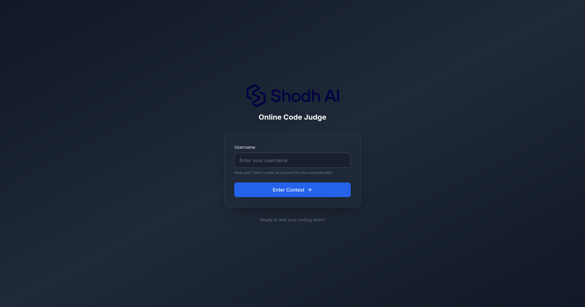
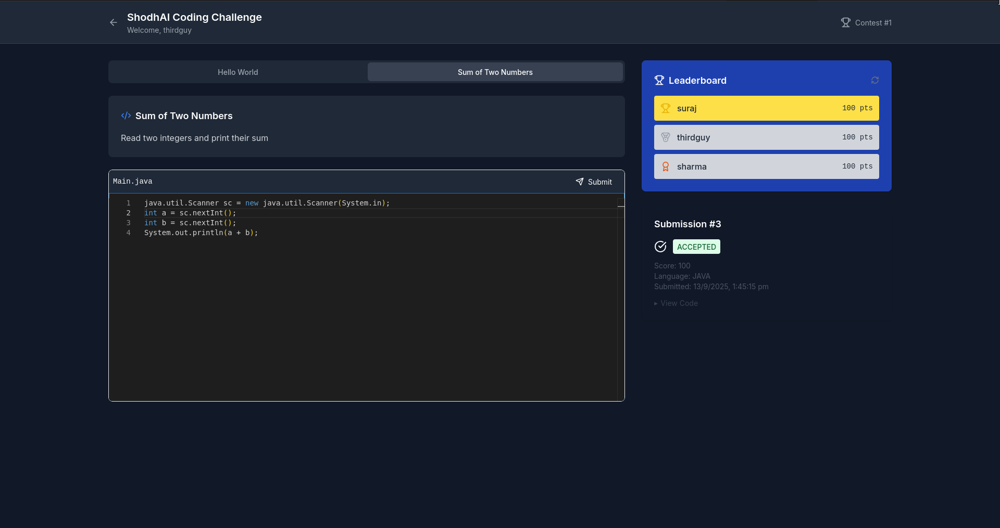

## shodhai shodh-a-code

this is a spring-boot/nextjs based online code judge

### to run locally

1. clone the repo
2. run `docker compose up --build` inside the app roor dir

- now you can use the app in the browser at http://localhost:3000

### demo

- as a demo of a fully deployed solution, a working instance of the app is hosted at http://128.199.160.116:3000/
- there are a few changes needed for cors enabling on a prod instance, these are fairly obvious from the code

### api design

- The complete Swagger documentation is available [here](http://128.199.160.116:8080/swagger-ui/index.html) and on  http://localhost:8080/swagger-ui.html once the local instance is up.
-  OpenAPI specs are availabele [here](http://128.199.160.116:8080/v3/api-docs) and on  http://localhost:8080/v3/api-docs once the local instance is running

### design choices

- persistence on the backend has been done with H2/jakarta database as more thorough persistence was not a priority
- rest is pretty standard MVC model
- not using DTOs, IOC etc for sake of simplicity 
- there is no auth as it was not specified, but a basic check is in place for simple security/leaderboard 

### user and session management

- although no auth strategy was mentioned in the requirements, a basic user and session management setup has been implemented whereby:
  - a new user is created/signed in upon entering the username
  - this user is stored in db, and a session is controlled via localStorage variables
  - if the backend restarts, and then user submits without logging back in, they are redirected to the start page

### docker configuration

- probably the most interesting aspect of the app is the way it uses docker and docker-in-docker to get the code results
- firstly, we have the `docker-compose.yml` which does the following:
  - 

### more about the application

- [backend readme](./backend/readme.md) (has solutions to sample problems and more!)
- [frontend readme](./frontend/readme.md)

